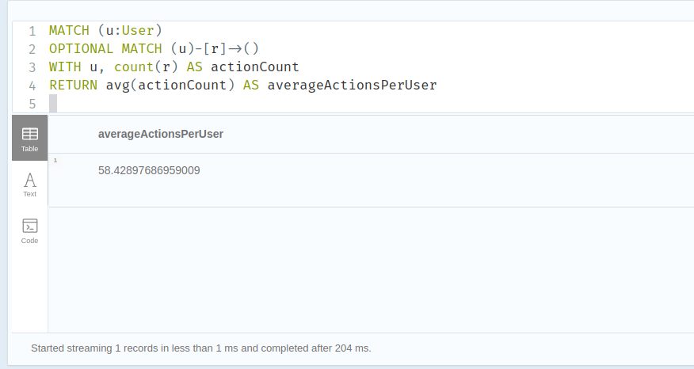

## Neo4j Project

This project is an exaple of the usage of Neo4j graph database.

### Dataset

 A dataset available in the Stanford Large Network Dataset Collection (SNAP). It focuses on Massive Open Online Courses (MOOCs) and contains information about user interactions within these online learning platforms.

MOOCs are online courses that are open to anyone and typically attract a large number of participants. This dataset specifically captures user actions and interactions within MOOCs, providing valuable insights into user behavior and engagement.

The dataset contains 3 files:
* `mooc_actions.tsv` contains information about user actions within the MOOCs.
* `mooc_actions_features.tsv` contains information about the features of the user actions.
* `mooc_actions_labels.tsv` contains information about the labels of the user actions.


### Data Model

The data model is composed of 2 nodes:
* `User` node, which represents a user.
* `Target` node, which represents a target (e.g. a video, a quiz, etc.).

The data model is composed of 1 relationship:

* `PERFORMS_ACTION`, which represents the action performed by a user on a target.

### Load data in Neo4j
To load data into Neo4j we used the main.py file. We used the py2neo library to connect to the database and to load the data. In order to load data we used data structures such as dictionaries and sets.In this way the data loaded faster and we avoided duplicates.

## Queries

### Show a small portion of your graph database (screenshot)


### Count all users, count all targets, count all actions

### 1. Count all users
```
MATCH (u:User)
RETURN count(u)
```
and the result is 7047

### 2. Count all targets
```
MATCH (t:Target)
RETURN count(t)
```

and the result is 97

### 3. Count all actions
```
MATCH ()-[r]->()
RETURN count(r) AS actionCount

```
and the result is 411749

### Show all actions (actionID) and targets (targetID) of a specific user (choose one)
```
MATCH (u:User {id: '1'})
MATCH (u)-[r]->(t:Target)
RETURN r.id AS actionID, t.id AS targetID
```
and the result is


### For each user, count his/her actions
```
MATCH (u:User)-[r]->()
RETURN u.id AS userID, count(r) AS actionCount
```
and the result is


### For each target, count how many users have done this target
```
MATCH (u:User)-[r]->(t:Target)
RETURN t.id AS targetID, count(DISTINCT u) AS userCount
```
and the result is


### Count the average actions per user

```
MATCH (u:User)
OPTIONAL MATCH (u)-[r]->()
WITH u, count(r) AS actionCount
RETURN avg(actionCount) AS averageActionsPerUser
```
and the result is


### Show the userID and the targetID, if the action has positive Feature2

```
MATCH (u:User)-[r]->(t:Target)
WHERE toFloat(r.feature2) > 0
RETURN u.id AS userID, t.id AS targetID
```
and the result is:


### For each targetID, count the actions with label “1”

```
MATCH (u:User)-[r]->(t:Target)
WHERE r.label = 1
RETURN t.id AS targetID, count(r) AS actionCount
```
and the result is:


#### Authors
* **Marios Aintini**
* **Giorgios Zarkadas**
